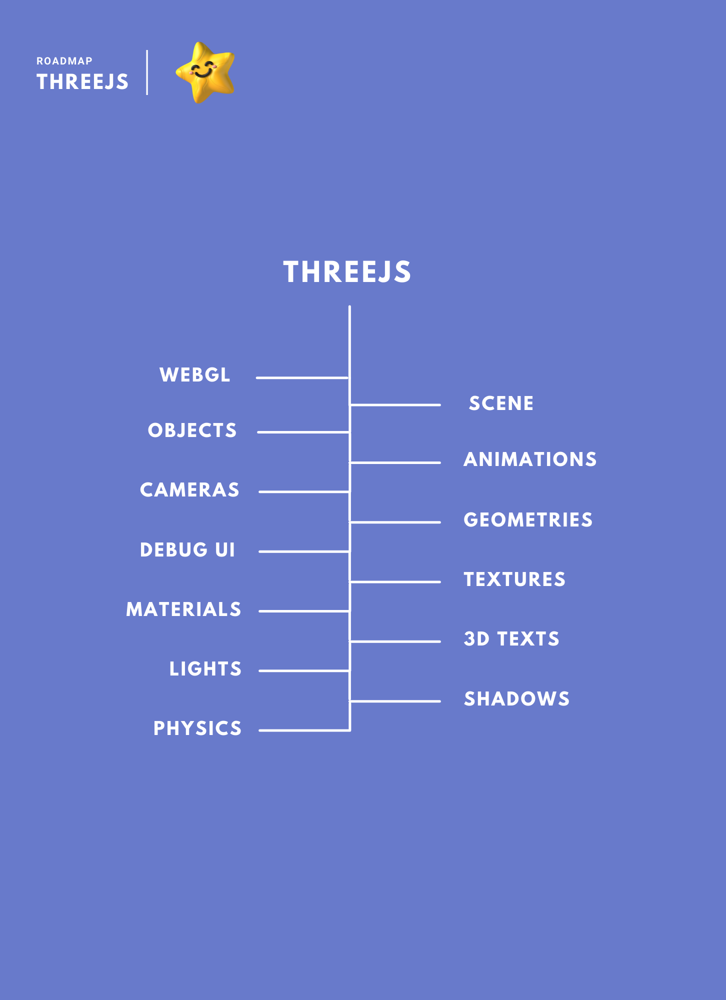

> This is a Complete Roadmap For Becoming a 3D Web Developer  

# ThreeJs :star:
**Below** you find a set of charts demonstrating the *paths* that you can take and the **technologies** to give you a **prespective tree** of concepts in use in order to become a **3D Web Developer**. This chart's have generated by ThreeJs community **memebers** and **guidlines** with the latest **technologies** available.
> Fork Now For Avoiding **Concept Missing** While Learning  

# Overview

3D Text (https://codepen.io/sanprieto/pen/XWNjBdb?editors=0010)

# Note to Beginners
These **roadmaps** cover everything that is there to learn for the *paths* listed below. Don't feel overwhelmed, you don't need to learn it all in the beginning if you are just getting started. Also there is available **prepared** 3D objects to boost your learning process.

# Lessons
 

## Lesson 1
**Containing**:
* [ ] Import Library  
* [ ] Create Geometry  
* [ ] Add Material  
* [ ] Create Mesh  
* [ ] Add Camera  
* [ ] Create Scene  

**Sources**:
* [Import in React](https://stackoverflow.com/questions/65468784/how-can-i-use-third-js-library-in-react "Stackoverflow")
* [Custom Geometry](https://stackoverflow.com/questions/17363397/three-js-custom-geometry "Stackoverflow")
* [Create Material](https://stackoverflow.com/questions/45029209/silver-polished-material-in-three-js "Stackoverflow")

   

## Lesson 2
**Containing**:
* [ ] Improve Scene  
* [ ] Responsive Scene  
* [ ] Axes Helper  

**Sources**:
* [Axes Concept](https://stackoverflow.com/questions/62452357/three-js-calculating-the-transformation-matrix-between-two-buffergeometry-posit/62457676#62457676 "Stackoverflow")

   

## Lesson 3
**Containing**:
* [ ] Canvas  
* [ ] Mesh  
* [ ] Cameras  

**Sources**:
* [Set Canvas To Center](https://stackoverflow.com/questions/44029427/how-to-center-the-three-js-canvas "Stackoverflow")
* [Animate Mesh](https://stackoverflow.com/questions/67814021/animating-three-js-mesh-in-the-canvas-to-the-mapbox-map "Stackoverflow")
* [Camera Handeling](https://stackoverflow.com/questions/51151586/three-js-how-to-rotate-object-instead-of-rotating-the-camera "Stackoverflow")

   

## Lesson 4
**Containing**:
* [ ] Groups  
* [ ] Animations  
* [ ] Time  

**Sources**:
* [Groups Callback](https://stackoverflow.com/questions/65482826/three-js-loading-manager-how-to-create-separate-groups-with-separate-callbacks "Stackoverflow")
* [Animation Sample](https://stackoverflow.com/questions/42756670/regarding-three-js-animation "Stackoverflow")
* [Improve Loading](https://stackoverflow.com/questions/49006997/improving-three-js-loading-time "Stackoverflow")

   

## Lesson 5
**Containing**:
* [ ] Camera  
* [ ] Positions  
* [ ] OrbitControl  

**Sources**:
* [Update Orbit Control](https://stackoverflow.com/questions/52607157/move-camera-and-update-its-orbitcontrol-in-three-js "Stackoverflow")
* [Orbit Experience](https://stackoverflow.com/questions/66286987/three-js-orbitcontrol-misbehaving "Stackoverflow")

   

## Lesson 6
**Containing**:
* [ ] Window Resize  
* [ ] Cursor  

**Sources**:
* [Resizing Experience](https://stackoverflow.com/questions/60473182/three-js-window-resizing-issue-not-real-view-size "Stackoverflow")
* [Raycasting Cursor](https://stackoverflow.com/questions/43952747/three-js-raycasting-find-point-closest-to-cursor "Stackoverflow")

   

# Contribution
Have a look at **contribution** docs and **discussions** for how to update any of the roadmaps.

* Open pull request with improvements  
* Discuss ideas in issues  
* Spread the word  
* Reach out with any feedback
