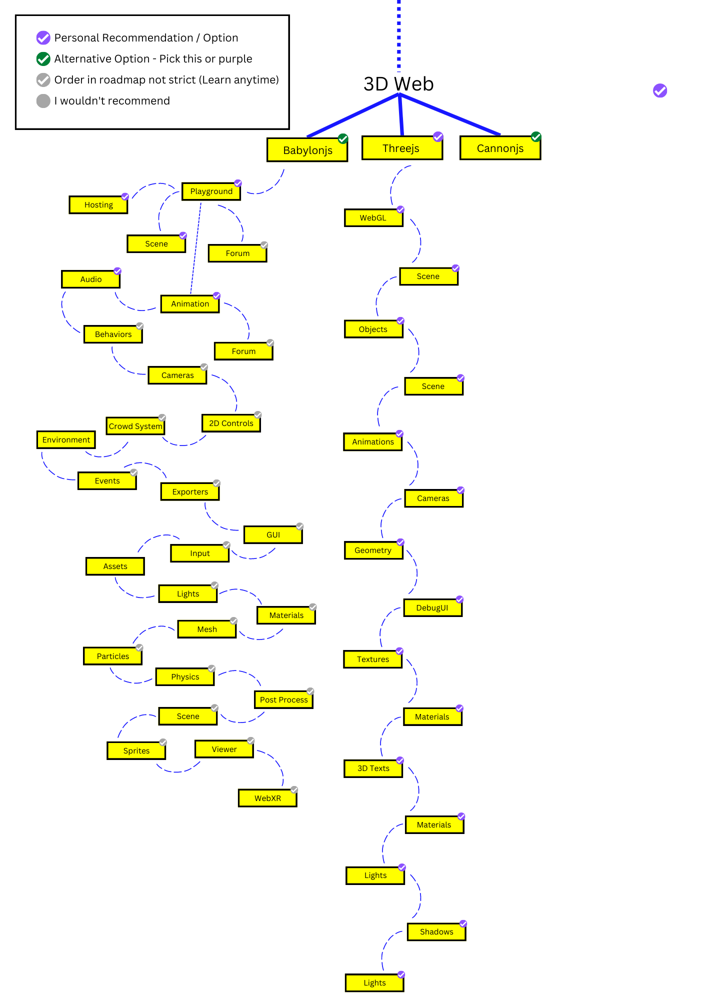

<div align="center">
  
  <h1>3D Web Roadmap</h1>
  
  
  
  
  
  <p>
  In this roadmap, you will find all the material required to master 3D Web including</br>technologies, tools, roadmaps, objects and furthermore
  </p>
</div>
# Building ...
The project is currently in the development stage and we are looking for contributors.
If you want to be part of this big roadmap, which helps more developers transform faster with guidelines dedicated to the 3d world, read the check the contirbutions section in this readme.

# Usage
Clone the repository, install the dependencies and start the lessons with the base code.

```shell
git clone https://github.com/Chamepp/3D-Web-Roadmap.git
cd lesson
npm install
npm start
```


# The Roadmap :closed_book:
This is the ultimate path for your web development transformation, which helps you with finding your way through 3D web development, gathering the tools and resources needed to master.
The roadmap includes the 9 top library which is used for todays 3D web development, with resources, code snippets and commonly asked questions inside it.
There are also specific materials for your journey including the objects section, arming you with objects you can practice on.

# Resources :balloon:
The resources gathered for this roadmap are presented by the latest updates and features around the web.

The roadmap includes:

1. Learning Path
2. Code Snippets
3. Common Bugs
4. Commonly Asked Questions
5. Latest Tutorial Blogs and Videos

# Contribution :round_pushpin:
Have a look at **[contirbutions](https://github.com/Chamepp/3D-Web-Roadmap/blob/master/CONTRIBUTING.md)** docs and **[discussions](https://github.com/Chamepp/3D-Web-Roadmap/discussions)** for how to update roadmaps.
Then select what you want to work on in [issues](https://github.com/Chamepp/3D-Web-Roadmap/issues) section and [improvements](https://wirehaired-faucet-769.notion.site/a435b3723c2a482abef3856d5bc53901?v=76d6978b3f89410f853b7e6c8ec504b7) list for bugs and updates.
